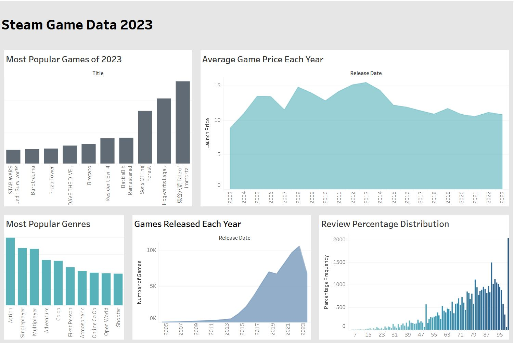

# SQL

The purpose of this project is to explore how postgresql can be used to store data from a file and how data can be visualised using tableau.

Tableau Dashboard: https://public.tableau.com/app/profile/jules.james2039/viz/SteamGameDataFrom2023Visualisation/Dashboard1

Project Steps:
1. Import data from csv file into a local postgresql database using python and psycopg.
2. Create tables and queries to store the data, normalise tables up to 3NF.
3. Import data into tableau and create a dashboard to provide useful analytics on the data.

The steam game data contains information about over 65,000 games taken from 2023. Available here: https://docs.google.com/spreadsheets/d/1D5MErWbFJ2Gsde9QxJ_HNMltKfF6fHCYdv4OQpXdnZ4/edit?gid=90041317#gid=90041317

Dashboard Preview:

